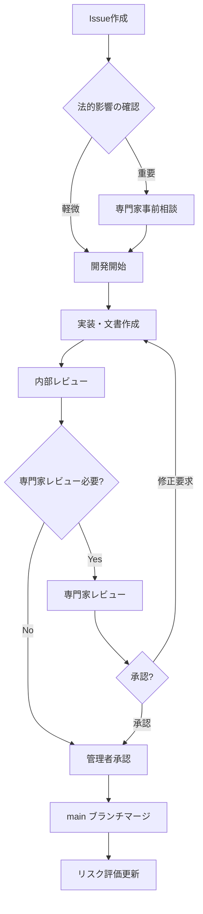

# CLAUDE.md - GitHub運用ルール・ガイド

> **このファイルについて**  
> このファイルは、バーチャルオフィス契約書類プロジェクトのGitHub運用ルール、開発フロー、作業ガイドを定義します。
> Claudeとの協働や継続的な改善のためのプロセスも含みます。

## 📋 目次
1. [プロジェクト概要](#プロジェクト概要)
2. [ブランチ戦略](#ブランチ戦略)
3. [Issue管理](#issue管理)
4. [プルリクエスト](#プルリクエスト)
5. [法務・コンプライアンスワークフロー](#法務コンプライアンスワークフロー)
6. [リリース管理](#リリース管理)
7. [品質管理](#品質管理)
8. [Claudeとの協働ガイド](#claudeとの協働ガイド)

---

## 🎯 プロジェクト概要

### ミッション
バーチャルオフィス事業における契約書類の**法令遵守**と**継続的改善**を実現する。

### 重要な原則
- **Legal First**: 法的要件を最優先に考慮する
- **Continuous Compliance**: 継続的なコンプライアンス体制を構築する
- **Expert Review**: 専門家レビューを必須とする
- **Risk Management**: 法的リスクの予防と軽減を重視する
- **Transparency**: 変更履歴と意思決定過程を明確にする

---

## 🌳 ブランチ戦略

### ブランチ構成

```
main (プロダクション)
├── develop (開発ブランチ・デフォルト)
    ├── feature/legal-compliance-enhancement
    ├── feature/document-revision
    ├── hotfix/critical-legal-fix
    └── release/v2.0.0
```

### ブランチの役割

#### `main` - プロダクションブランチ
- **目的**: 専門家承認済みの安定版
- **保護**: 直接プッシュ禁止、PR必須
- **マージ条件**: 専門家レビュー完了 + 全チェック通過

#### `develop` - 開発ブランチ（デフォルト）
- **目的**: 開発作業の統合ブランチ
- **保護**: 直接プッシュ禁止、PR必須
- **マージ条件**: コードレビュー + CI通過

#### `feature/*` - 機能開発ブランチ
- **命名規則**: `feature/[epic-number]-[brief-description]`
- **例**: `feature/123-aml-compliance-enhancement`
- **開始点**: `develop`
- **マージ先**: `develop`

#### `hotfix/*` - 緊急修正ブランチ
- **命名規則**: `hotfix/[issue-number]-[brief-description]`
- **例**: `hotfix/456-privacy-policy-urgent-fix`
- **開始点**: `main`
- **マージ先**: `main` および `develop`

#### `release/*` - リリース準備ブランチ
- **命名規則**: `release/v[version]`
- **例**: `release/v1.2.0`
- **開始点**: `develop`
- **マージ先**: `main` および `develop`

### ブランチ保護ルール

#### `main` ブランチ
- [ ] 直接プッシュを禁止
- [ ] PRマージ前に以下を必須とする：
  - [ ] 専門家レビュー（弁護士または行政書士）
  - [ ] プロジェクト管理者の承認
  - [ ] 全ステータスチェックの通過
  - [ ] 最新のdevelopブランチとの同期

#### `develop` ブランチ
- [ ] 直接プッシュを禁止
- [ ] PRマージ前に以下を必須とする：
  - [ ] 最低1名のコードレビュー
  - [ ] 全ステータスチェックの通過
  - [ ] 法務チェックリストの確認

---

## 📋 Issue管理

### Issue種別と使い分け

| 種別 | 用途 | ラベル | テンプレート |
|------|------|--------|-------------|
| **Epic** | 大きな機能・改善項目 | `epic` | epic.yml |
| **Story** | Epicを構成する具体的作業 | `story` | story.yml |
| **Bug** | 不具合・法的問題 | `bug` | bug.yml |
| **Task** | その他の独立した作業 | `task` | task.yml |

### ラベル体系

#### 種別ラベル
- `epic` - Epic
- `story` - Story
- `bug` - Bug Report
- `task` - Task

#### 優先度ラベル
- `priority:critical` - 緊急（法的リスクあり）
- `priority:high` - 高
- `priority:medium` - 中
- `priority:low` - 低

#### 分野ラベル
- `legal:postal-law` - 郵便法関連
- `legal:aml` - 犯罪収益移転防止法関連
- `legal:privacy` - 個人情報保護法関連
- `legal:consumer` - 消費者契約法関連
- `legal:corporate` - 商法・会社法関連

#### 状態ラベル
- `needs-triage` - トリアージ待ち
- `needs-expert-review` - 専門家レビュー必要
- `in-progress` - 作業中
- `blocked` - ブロック中
- `ready-for-review` - レビュー準備完了

#### 影響範囲ラベル
- `impact:critical` - 事業継続に関わる
- `impact:high` - 重要な機能に影響
- `impact:medium` - 一部機能に影響
- `impact:low` - 軽微な影響

### Issue作成ガイドライン

#### Epic作成時のポイント
1. **明確なビジネス価値**を記載する
2. **法的根拠**を明確にする
3. **完了条件**を具体的に定義する
4. **リスク評価**を含める
5. **専門家レビューの要否**を明記する

#### Story作成時のポイント
1. **ユーザーストーリー形式**で記載する
2. **受け入れ条件**を明確にする
3. **関連Epic**を必ず紐付ける
4. **作業サイズ**を適切に見積もる
5. **法的影響**があれば明記する

#### Bug Report作成時のポイント
1. **法的リスクレベル**を明確にする
2. **影響範囲**を具体的に記載する
3. **根拠法令**を明記する
4. **緊急度**を適切に設定する
5. **暫定回避策**があれば記載する

---

## 🔄 プルリクエスト

### PRの種類

#### 通常のPR（develop ← feature）
- **目的**: 機能追加、改善、修正
- **レビュー**: 最低1名
- **マージ**: Squash merge推奨

#### 重要なPR（main ← develop/release）
- **目的**: プロダクションリリース
- **レビュー**: 専門家レビュー必須
- **マージ**: Merge commit（履歴保持）

#### 緊急PR（main ← hotfix）
- **目的**: 緊急の法的問題対応
- **レビュー**: 専門家の緊急レビュー
- **マージ**: 迅速対応、後日詳細レビュー

### PRテンプレート

#### 基本情報
```markdown
## 📝 変更内容
[変更内容の概要を記載]

## 🎫 関連Issue
Closes #[issue番号]

## ⚖️ 法的影響
- [ ] 法的影響なし
- [ ] 軽微な法的影響（専門家レビュー不要）
- [ ] 重要な法的影響（専門家レビュー必要）
- [ ] 緊急の法的リスク対応

## ✅ チェックリスト
- [ ] 関連する契約書類の整合性を確認
- [ ] 法務チェックリストを確認
- [ ] リスク評価を更新（必要に応じて）
- [ ] ドキュメントを更新
- [ ] テストを実行（該当する場合）

## 🔍 レビューのポイント
[レビューしてほしい特定のポイントを記載]

## 📋 テスト内容
[実施したテスト内容を記載]
```

### レビュー基準

#### コードレビュー観点
1. **法的正確性**: 法令への適合性
2. **文書品質**: 誤字脱字、表現の適切性
3. **一貫性**: 他の文書との整合性
4. **完全性**: 必要な項目の網羅性
5. **リスク評価**: 潜在的リスクの特定

#### 専門家レビュー観点
1. **法令適合性**: 関連法令への完全な準拠
2. **実務適用性**: 実際の運用での妥当性
3. **リスク評価**: 法的リスクの適切な評価
4. **将来対応**: 法改正等への対応力
5. **業界標準**: 業界標準との比較

---

## ⚖️ 法務・コンプライアンスワークフロー

### 法的文書の変更フロー



### 専門家レビューフロー

#### 1. レビュー依頼
- **タイミング**: 法的影響のある変更時
- **方法**: `40_expert-review/` ディレクトリに資料配置
- **内容**: 変更内容、法的根拠、リスク評価

#### 2. レビュー実施
- **期間**: 通常1-2週間
- **形式**: 書面 + 必要に応じて面談
- **結果**: 承認/条件付き承認/差し戻し

#### 3. フィードバック対応
- **記録**: `40_expert-review/修正指摘事項/` に保管
- **対応**: 指摘事項に基づく修正実施
- **再レビュー**: 必要に応じて再度レビュー依頼

### 緊急時対応フロー

#### Critical Issue対応
1. **即座の対応判断**（1時間以内）
2. **暫定措置の実施**（24時間以内）
3. **専門家への緊急相談**（48時間以内）
4. **根本対策の実施**（1週間以内）
5. **再発防止策の策定**（2週間以内）

---

## 🚀 リリース管理

### バージョニング

#### セマンティックバージョニング採用
- **Major (x.0.0)**: 法的要件の大幅変更
- **Minor (1.x.0)**: 新機能追加、重要な改善
- **Patch (1.1.x)**: バグ修正、軽微な修正

#### リリースタイムライン
- **Major**: 年1-2回（法改正対応等）
- **Minor**: 四半期ごと（定期改善）
- **Patch**: 必要に応じて（緊急修正）

### リリースプロセス

#### 1. リリース計画
- **内容確定**: 含める機能・修正の決定
- **リスク評価**: リリース内容の法的リスク評価
- **専門家確認**: 必要に応じて専門家レビュー

#### 2. リリースブランチ作成
```bash
git checkout develop
git pull origin develop
git checkout -b release/v1.2.0
```

#### 3. リリース準備
- [ ] バージョン番号更新
- [ ] CHANGELOG.md更新
- [ ] 最終テスト実施
- [ ] ドキュメント更新

#### 4. リリース実行
```bash
git checkout main
git merge release/v1.2.0
git tag v1.2.0
git push origin main --tags
```

#### 5. リリース後処理
- [ ] develop ブランチへのマージ
- [ ] リリースノート作成
- [ ] ステークホルダーへの連絡

---

## 🔍 品質管理

### 品質保証プロセス

#### 文書品質チェック
- [ ] **誤字脱字**: スペルチェック、文法確認
- [ ] **表現統一**: 用語集との整合性
- [ ] **構成確認**: 論理的な構成、読みやすさ
- [ ] **完全性**: 必要項目の網羅性

#### 法的品質チェック
- [ ] **法令適合**: 関連法令への準拠確認
- [ ] **条項整合**: 契約書間の整合性
- [ ] **リスク評価**: 潜在的リスクの特定
- [ ] **実用性**: 実際の運用での妥当性

#### 継続的改善
- [ ] **定期レビュー**: 四半期ごとの全体見直し
- [ ] **法改正対応**: 関連法令の改正追跡
- [ ] **業界動向**: 業界標準との比較
- [ ] **フィードバック**: 利用者からの意見収集

### 品質メトリクス

#### 追跡指標
- **リーガルリスク**: 高/中/低リスク項目数
- **専門家承認率**: レビュー通過率
- **対応時間**: Issue対応の平均時間
- **文書品質**: レビュー指摘事項数

#### 品質目標
- **高リスク項目**: 0件維持
- **専門家レビュー**: 重要変更100%実施
- **緊急対応**: 24時間以内に初期対応
- **定期更新**: 四半期ごとの見直し実施

---

## 🤖 Claudeとの協働ガイド

### 効果的なClaude活用方法

#### 1. Issue作成・管理
```
Prompt例:
「郵便法の信書規制について新しいガイドラインが出ました。
これに基づいてEpicを作成し、必要な対応を整理してください」
```

#### 2. 文書作成・修正
```
Prompt例:
「個人情報保護法の改正に対応して、個人情報保護方針を修正してください。
特に利用目的の記載を具体化し、第三者提供の条件を明確化してください」
```

#### 3. リスク評価
```
Prompt例:
「現在の契約書類について、消費者契約法の観点から
不当条項のリスク評価を実施してください」
```

#### 4. 専門家レビュー準備
```
Prompt例:
「弁護士レビュー用に、今回の契約書修正の要点をまとめ、
確認してほしいポイントを整理してください」
```

### Claudeとの協働ベストプラクティス

#### Do's
- [ ] **具体的な指示**: 明確で具体的な作業指示
- [ ] **文脈提供**: 十分な背景情報の提供
- [ ] **段階的作業**: 大きな作業は小さく分割
- [ ] **確認・検証**: 生成内容の確認と検証
- [ ] **専門家確認**: 重要事項は専門家の確認必須

#### Don'ts
- [ ] **法的助言依存**: Claudeの出力を法的助言として扱わない
- [ ] **一括丸投げ**: 大きすぎる作業の一括依頼
- [ ] **無検証利用**: 生成内容の無検証利用
- [ ] **機密情報**: 機密性の高い情報の過度な共有

### プロジェクト固有のClaude設定

#### 推奨設定
- **トーン**: 専門的かつ簡潔
- **出力形式**: Markdown、構造化
- **チェックポイント**: 法的正確性、実用性
- **参考情報**: 関連法令、業界標準

#### カスタムプロンプト例
```
あなたはバーチャルオフィス事業の法務コンプライアンス専門のアシスタントです。
以下の点に注意して回答してください：

1. 法的正確性を最優先とする
2. リスクがある場合は必ず専門家確認を推奨する
3. 実用性と理論のバランスを考慮する
4. 関連法令との整合性を確認する
5. 将来の法改正への対応可能性を考慮する
```

---

## 📅 定期的な運用タスク

### 週次タスク
- [ ] **Issue確認**: 新規Issue/PR の確認とトリアージ
- [ ] **進捗確認**: 進行中作業の状況確認
- [ ] **緊急事項**: Critical/High優先度項目の対応状況確認

### 月次タスク
- [ ] **メトリクス確認**: 品質指標の確認と分析
- [ ] **リスク評価**: 月次リスク評価の実施
- [ ] **文書更新**: 定期的な文書メンテナンス

### 四半期タスク
- [ ] **全体レビュー**: 契約書類の包括的レビュー
- [ ] **法改正確認**: 関連法令の改正情報確認
- [ ] **業界動向**: 業界標準との比較分析
- [ ] **プロセス改善**: 運用プロセスの見直し

### 年次タスク
- [ ] **専門家監査**: 弁護士による包括的監査
- [ ] **戦略見直し**: プロジェクト戦略の見直し
- [ ] **教育研修**: スタッフ向け研修の実施
- [ ] **システム更新**: 管理システムの更新・改善

---

## 📞 緊急時連絡体制

### エスカレーション
1. **Level 1**: プロジェクト担当者
2. **Level 2**: プロジェクト管理者
3. **Level 3**: 専門家（弁護士・行政書士）
4. **Level 4**: 経営陣

### 緊急事態の定義
- **Critical**: 法的処分リスク、事業停止リスク
- **High**: 顧客影響、重要な法的問題
- **Medium**: 限定的影響、計画的対応可能
- **Low**: 軽微な問題、定期対応可能

---

## 🔄 このドキュメントの更新

### 更新トリガー
- プロジェクトプロセスの変更
- 重要な学習事項の発生
- 法改正やガイドライン変更
- ツール・システムの変更

### 更新プロセス
1. **変更提案**: Issue作成
2. **検討・議論**: 関係者での議論
3. **修正作業**: ドキュメント修正
4. **承認**: プロジェクト管理者承認
5. **適用**: 新運用の開始

---

**最終更新**: 2025年8月18日  
**次回レビュー予定**: 2025年11月18日