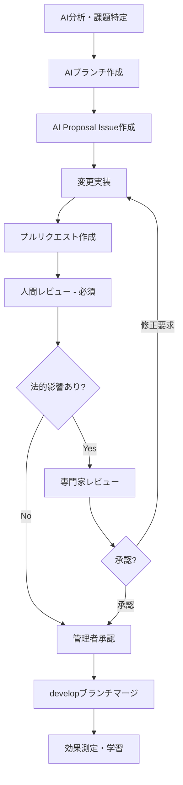

# AI協働ガイド

> **Claude等のAIとの効果的な協働方法**  
> AI提案フロー・品質保証・必須プロセスの完全ガイド

## 🤖 AI変更管理フロー

### AI提案の基本フロー



### AI提案の種類と対応レベル

| 提案種類 | 緊急度 | 人間レビュー | 専門家レビュー | 対応期限 |
|----------|--------|-------------|---------------|----------|
| **Critical**: 法的リスク対応 | 最高 | 必須 | 必須 | 24時間以内 |
| **High**: 重要な法令適合 | 高 | 必須 | 必須 | 1週間以内 |
| **Medium**: 一般的改善 | 中 | 必須 | 推奨 | 1ヶ月以内 |
| **Low**: 軽微な修正 | 低 | 必須 | 任意 | 次回更新時 |

### AI提案時のブランチ命名規則

```bash
# AI提案ブランチの例
ai/legal-compliance-fix          # 法令遵守の修正
ai/privacy-policy-update         # プライバシーポリシー更新
ai/contract-term-improvement     # 契約条項の改善
ai/risk-assessment-update        # リスク評価の更新
ai/documentation-enhancement     # 文書改善
```

---

## 💡 効果的なClaude活用方法

### 1. Issue作成・管理

#### 活用シーン
- 法改正対応のEpic/Story作成
- 複雑な法的課題の整理・分析
- リスク評価の構造化

#### 効果的なプロンプト例
```
郵便法の信書規制について新しいガイドラインが出ました。
これに基づいてEpicを作成し、必要な対応を整理してください。

以下の観点で分析してください：
1. 現行契約書への影響
2. 必要な修正箇所の特定
3. リスクレベルの評価
4. 対応優先順位の提案
```

### 2. 文書作成・修正

#### 活用シーン
- 契約書条項の改善提案
- 法改正に対応した文書更新
- 新しい契約書の作成支援

#### 効果的なプロンプト例
```
個人情報保護法の改正に対応して、個人情報保護方針を修正してください。

修正要件：
- 利用目的の記載を具体化
- 第三者提供の条件を明確化
- 最新の法改正内容を反映
- 他の契約書との整合性を確保

現在の文書: [文書内容を添付]
```

### 3. リスク評価・分析

#### 活用シーン
- 法的リスクの体系的評価
- 新しいビジネスモデルのリスク分析
- 契約条項の潜在的問題特定

#### 効果的なプロンプト例
```
現在の契約書類について、消費者契約法の観点から
不当条項のリスク評価を実施してください。

評価項目：
1. 不当条項に該当する可能性のある条項
2. リスクレベル（Critical/High/Medium/Low）
3. 具体的な修正提案
4. 法的根拠の明記
```

### 4. 専門家レビュー準備

#### 活用シーン
- 専門家レビュー用資料の作成
- 質問事項の整理・構造化
- レビューポイントの明確化

#### 効果的なプロンプト例
```
弁護士レビュー用に、今回の契約書修正の要点をまとめ、
確認してほしいポイントを整理してください。

含める内容：
1. 修正内容の概要・背景
2. 法的影響の評価
3. 具体的な確認事項
4. 参考資料・関連法令
```

---

## 🔄 AI作業時の必須プロセス

### **重要**: 全てのAI（Claude等）が従うべき必須フロー

#### 1. 事前準備
```bash
# 現在のブランチ確認
git status
git branch

# 最新のdevelopブランチに同期
git checkout develop
git pull origin develop
```

#### 2. AIブランチ作成（必須）
```bash
# AI提案専用ブランチの作成
git checkout -b ai/[変更内容の概要]

# 例:
git checkout -b ai/privacy-policy-compliance-update
```

#### 3. 変更実装
- **提案された変更を実装**
- **AI Proposal Issue作成**（ai-proposal.ymlテンプレート使用）
- **詳細な変更記録**の作成

#### 4. GitHubプッシュ（必須）
```bash
# 変更をコミット
git add .
git commit -m "AI提案: [変更内容の説明]

- 具体的な変更内容1
- 具体的な変更内容2
- 法的根拠・参考情報"

# リモートにプッシュ
git push -u origin ai/[ブランチ名]
```

#### 5. 人間への確認促進（必須実行）

**以下のメッセージを必ず送信**:
```
🤖 AI作業が完了しました。以下をご確認ください：

**変更内容**: [具体的な変更内容]
**ブランチ**: ai/[変更内容]  
**法的影響度**: [Critical/High/Medium/Low]
**専門家レビュー**: [必要/推奨/不要]

**GitHubで確認**: 
- Issue: #[作成したIssue番号]
- PR: [プルリクエストのリンク]

変更内容をレビューしていただき、問題なければマージの承認をお願いします。
修正が必要な場合はお知らせください。
```

#### 6. 承認待ち
- **人間による承認なしには絶対にマージしない**
- **修正指示があれば対応し、再度確認を促す**
- **承認後のマージ作業をサポート**

### 適用範囲（全て対象）

#### 必須対象作業
- [ ] 契約書類の修正・追加
- [ ] ドキュメントの更新・追加  
- [ ] プロセス・ルールの変更
- [ ] 新しいファイルの作成
- [ ] ディレクトリ構造の変更
- [ ] 設定ファイルの変更
- [ ] その他プロジェクトへの変更全般

#### 禁止事項
- [ ] **直接マージ**: 人間の承認なしでの変更マージは絶対禁止
- [ ] **確認省略**: 変更後の確認促進メッセージの省略は禁止
- [ ] **ブランチ省略**: developや他のブランチへの直接変更は禁止

---

## ✅ AI提案の品質保証

### AI提案作成時の必須チェック項目

#### 法的・技術的確認
- [ ] **法的根拠の明確化**: 関連法令・ガイドラインの明記
- [ ] **リスク評価の実施**: 現状リスクと改善効果の分析
- [ ] **実装影響の評価**: 影響を受ける文書・プロセスの特定
- [ ] **代替案の検討**: 複数の選択肢の提示
- [ ] **専門家レビューの要否判断**: 法的影響度に応じた判断

#### 文書・プロセス品質
- [ ] **変更内容の明確化**: 何を、なぜ、どのように変更するか
- [ ] **整合性確認**: 他の文書・プロセスとの整合性
- [ ] **実装可能性**: 現実的な実装方法の提示
- [ ] **効果測定**: 変更による改善効果の予測

### 人間レビュー時の必須確認項目

#### 法的・実務確認
- [ ] **法的正確性**: AI提案の法的妥当性の確認
- [ ] **実務適用性**: 実際の業務での運用可能性
- [ ] **整合性**: 他の契約書類との整合性
- [ ] **顧客影響**: 利用者・顧客への影響評価
- [ ] **実装計画**: 現実的な実装スケジュールの確認

#### 品質・リスク確認
- [ ] **品質基準**: プロジェクト品質基準との適合性
- [ ] **リスク評価**: 提案実装に伴うリスクの再評価
- [ ] **長期影響**: 将来的な影響・副作用の検討
- [ ] **改善効果**: 期待される改善効果の妥当性

---

## 🎯 Claudeとの協働ベストプラクティス

### Do's（推奨事項）

#### AI提案時
- [ ] **段階的提案**: 大きな変更は小さく分割して提案
- [ ] **根拠明記**: 法的根拠・参考情報を明確に記載
- [ ] **複数案提示**: 可能な限り複数の選択肢を提示
- [ ] **リスク明示**: 潜在的リスクを隠さず明示
- [ ] **人間判断要請**: 判断が困難な部分は明確に人間レビューを要請

#### プロセス遵守
- [ ] **AIブランチ作成**: 提案ごとに独立したブランチを作成
- [ ] **構造化Issue**: AI Proposal テンプレートを必ず使用
- [ ] **詳細PR**: AI提案セクションを含む包括的なPR作成
- [ ] **継続的学習**: フィードバックを次回提案に活用

### Don'ts（禁止事項）

#### 技術的禁止事項
- [ ] **直接マージ**: 人間レビューなしでの直接マージは禁止
- [ ] **ブランチ省略**: 専用ブランチ作成の省略は禁止
- [ ] **確認省略**: 人間への確認促進の省略は禁止

#### 内容的禁止事項
- [ ] **法的助言**: AI出力を法的助言として扱わない
- [ ] **無根拠提案**: 法的根拠のない提案は行わない
- [ ] **過度な自信**: AI分析の限界を認識し、謙虚な姿勢を保つ
- [ ] **一括大規模変更**: 複数の法令・文書を一度に変更する提案は避ける

---

## 🚨 緊急時のAI活用ガイドライン

### Critical Issue対応時のAI活用

#### 1. 即座の分析（1時間以内）
- **状況分析**: Critical問題の緊急分析
- **暫定案提示**: 即座に実施可能な暫定対応案
- **リスク評価**: 緊急度・影響範囲の評価
- **エスカレーション**: 専門家への相談要否の判断

#### 2. 制限の明示
- **AI分析の限界**: AI分析の限界と不確実性を明記
- **人間判断の必要性**: 最終判断は人間が行うことを強調
- **専門家確認**: 法的問題は必ず専門家確認が必要

#### 3. 継続的支援
- **専門家エスカレーション**: 専門家への相談支援
- **追跡Issue作成**: 恒久対策のためのIssue作成支援
- **学習・改善**: 緊急事態から学んだ改善点の整理

---

## 📊 AI協働効果の測定

### 効果指標

#### 効率性指標
- **提案品質**: 人間レビューでの承認率
- **対応速度**: 課題特定から提案まての時間
- **修正回数**: 提案から承認までの修正回数
- **学習効果**: 継続的な提案品質向上

#### 品質指標
- **法的正確性**: 専門家レビューでの指摘率
- **実用性**: 実装後の効果・問題発生率
- **整合性**: 他文書との矛盾・不整合の発生率
- **満足度**: 人間レビュアーの満足度

### 継続的改善

#### 定期的振り返り
- **月次レビュー**: AI提案の品質・効果の振り返り
- **四半期評価**: AI協働プロセスの改善点抽出
- **年次戦略**: AI活用戦略の見直し・発展

#### 学習・適応
- **フィードバック活用**: 人間レビューからの学習
- **プロセス改善**: より効果的な協働方法の開発
- **知識蓄積**: プロジェクト固有の知識・ノウハウの蓄積

---

**最終更新**: 2025年8月18日  
**関連文書**: [Git運用ワークフロー](git-workflow.md) | [法務コンプライアンス](legal-compliance.md) | [品質管理](release-quality.md)