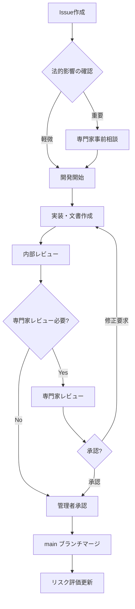

# 法務・コンプライアンスワークフロー

> **法的文書管理の完全ガイド**  
> 専門家レビュー・法令遵守・リスク管理の統合フロー

## ⚖️ 法的文書の変更フロー

### 基本的な変更フロー

### 法的影響度の判定基準

#### Critical（最高）
- 事業継続に関わる法的リスク
- 法的処分の可能性がある問題
- 専門家による緊急対応が必要

#### High（高）
- 重要な法令遵守事項
- 契約条項の重要な変更
- 顧客影響が大きい変更

#### Medium（中）
- 一般的な法令適合改善
- 軽微な契約条項の修正
- 予防的な改善措置

#### Low（低）
- 表現の統一・整理
- 軽微な誤字脱字の修正
- 文書構成の改善

---

## 👨‍⚖️ 専門家レビューフロー

### 1. レビュー依頼プロセス

#### 依頼タイミング
- **事前相談**: Critical/High影響の変更企画時
- **正式レビュー**: 実装完了後、適用前
- **緊急レビュー**: Critical問題の対応時

#### 依頼方法
- **資料配置**: `40_expert-review/` ディレクトリに資料配置
- **内容**: 変更内容、法的根拠、リスク評価、質問事項
- **形式**: 専門家レビュー依頼書（テンプレート使用）

#### 必要資料
- [ ] 変更内容の概要・詳細
- [ ] 関連法令・ガイドラインの確認状況
- [ ] リスク評価書
- [ ] 既存文書との整合性確認
- [ ] 具体的な質問・確認事項

### 2. レビュー実施

#### 標準的な期間
- **通常レビュー**: 1-2週間
- **緊急レビュー**: 24-48時間
- **包括的レビュー**: 2-4週間

#### レビュー形式
- **書面レビュー**: 詳細な書面による指摘・提案
- **面談**: 必要に応じて直接面談での確認
- **段階的レビュー**: 大規模変更は段階的に実施

#### レビュー結果
- **承認**: そのまま適用可能
- **条件付き承認**: 指定条件を満たせば適用可能
- **修正要求**: 指摘事項の修正が必要
- **差し戻し**: 根本的な再検討が必要

### 3. フィードバック対応

#### 指摘事項の管理
- **記録**: `40_expert-review/修正指摘事項/` に保管
- **分類**: Critical/High/Medium/Lowで優先度付け
- **追跡**: 対応状況を継続的に追跡

#### 修正実施
- **優先順位**: Critical → High → Medium → Low
- **期限設定**: 影響度に応じた対応期限
- **確認**: 修正内容の専門家確認

#### 再レビュー
- **条件**: 重要な修正がある場合
- **簡素化**: 修正箇所のみの限定レビュー
- **最終確認**: 適用前の最終承認

---

## 🚨 緊急時対応フロー

### Critical Issue対応手順

#### Phase 1: 即座の対応判断（1時間以内）
1. **リスク評価**: 法的リスクレベルの緊急評価
2. **影響範囲**: 影響を受ける文書・顧客の特定
3. **対応方針**: 暫定措置・根本対策の方針決定
4. **エスカレーション**: 必要に応じて専門家への緊急連絡

#### Phase 2: 暫定措置の実施（24時間以内）
1. **暫定対応**: 法的リスクを回避する暫定措置
2. **顧客対応**: 必要に応じて顧客への連絡・説明
3. **記録**: 対応内容の詳細記録
4. **監視**: 暫定措置の効果確認

#### Phase 3: 専門家への緊急相談（48時間以内）
1. **資料準備**: 緊急相談用の簡潔な資料作成
2. **専門家連絡**: 弁護士・行政書士への緊急相談
3. **指示確認**: 専門家指示の確認・記録
4. **対応計画**: 根本対策の具体的計画策定

#### Phase 4: 根本対策の実施（1週間以内）
1. **本格修正**: 専門家指示に基づく根本的修正
2. **全体確認**: 関連文書全体の整合性確認
3. **適用**: 修正内容の正式適用
4. **効果確認**: 対策効果の確認

#### Phase 5: 再発防止策の策定（2週間以内）
1. **原因分析**: 問題発生の根本原因分析
2. **プロセス改善**: 再発防止のためのプロセス改善
3. **チェック強化**: 関連チェック項目の強化
4. **教訓共有**: 学習事項の組織内共有

---

## 📊 法務品質保証システム

### 多層チェック体制

#### Layer 1: 自動チェック
- **用語統一**: 定義済み用語の統一使用
- **必須項目**: 法定記載事項の網羅確認
- **整合性**: 契約書間の矛盾検出

#### Layer 2: 内部レビュー
- **文書品質**: 誤字脱字・表現の適切性
- **論理構成**: 契約書の論理的構成
- **実用性**: 実際の運用での妥当性

#### Layer 3: 専門家レビュー
- **法令適合**: 関連法令への完全準拠
- **リスク評価**: 法的リスクの適切な評価
- **業界標準**: 業界標準との比較

### コンプライアンス指標

#### 必須遵守項目
- [ ] **郵便法**: 信書規制への適合
- [ ] **犯罪収益移転防止法**: 本人確認義務の履行
- [ ] **個人情報保護法**: 個人情報の適切な取扱い
- [ ] **消費者契約法**: 不当条項の排除
- [ ] **商法・会社法**: 会社登記要件の充足

#### 品質基準
- **法令適合率**: 100%維持
- **専門家承認率**: 重要変更100%
- **リスク管理**: Critical項目0件維持
- **対応時間**: 緊急事項24時間以内対応

---

## 📋 法務チェックリスト

### 契約書作成・修正時の必須確認事項

#### 基本項目
- [ ] 法的根拠の明確化
- [ ] 必要記載事項の網羅
- [ ] 法定用語の正確な使用
- [ ] 契約条項の明確性・理解容易性

#### 法令遵守確認
- [ ] 関連法令への適合確認
- [ ] 最新の法改正情報の反映
- [ ] 業界ガイドラインとの整合
- [ ] 不当条項の排除

#### リスク評価
- [ ] 法的リスクの特定・評価
- [ ] 顧客・事業への影響評価
- [ ] 将来の法改正への対応可能性
- [ ] 代替案・回避策の検討

#### 品質確認
- [ ] 他の契約書との整合性
- [ ] 実際の運用での妥当性
- [ ] 専門家レビューの要否判断
- [ ] 更新・見直しスケジュールの設定

---

**最終更新**: 2025年8月18日  
**関連文書**: [Git運用ワークフロー](git-workflow.md) | [品質管理](release-quality.md) | [緊急時対応](operations.md)