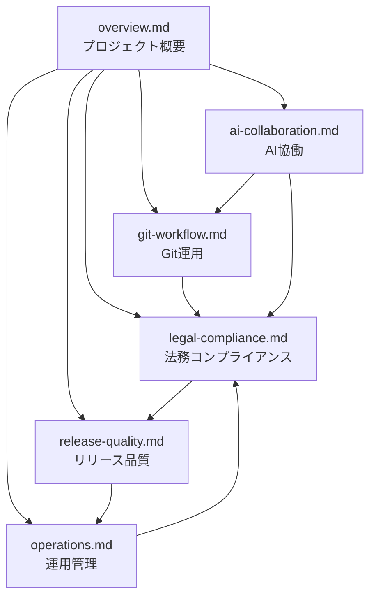

# 📍 ナビゲーション・検索インデックス

> **すべてのドキュメントへの高速アクセス**  
> キーワード検索・タスク別ガイド・緊急時クイックアクセス

## 🔍 キーワード検索テーブル

| キーワード | 主な内容 | 関連ファイル |
|------------|----------|-------------|
| **ブランチ戦略** | Git運用・ブランチ命名・保護ルール | [git-workflow.md](git-workflow.md#ブランチ戦略) |
| **Issue管理** | Issue種別・ラベル体系・作成ガイドライン | [git-workflow.md](git-workflow.md#issue管理) |
| **プルリクエスト** | PR種類・テンプレート・レビュー基準 | [git-workflow.md](git-workflow.md#プルリクエスト) |
| **専門家レビュー** | レビューフロー・依頼方法・期間 | [legal-compliance.md](legal-compliance.md#専門家レビューフロー) |
| **法的影響度** | Critical/High/Medium/Low判定基準 | [legal-compliance.md](legal-compliance.md#法的影響度の判定基準) |
| **緊急時対応** | Critical対応・エスカレーション体制 | [legal-compliance.md](legal-compliance.md#緊急時対応フロー), [operations.md](operations.md#緊急時連絡体制) |
| **AIブランチ** | AI提案ブランチ・命名規則・作成方法 | [ai-collaboration.md](ai-collaboration.md#ai提案時のブランチ命名規則) |
| **AI必須プロセス** | AI作業時の必須フロー・禁止事項 | [ai-collaboration.md](ai-collaboration.md#ai作業時の必須プロセス) |
| **リリース管理** | バージョニング・リリースプロセス | [release-quality.md](release-quality.md#リリース管理) |
| **品質管理** | 品質保証・メトリクス・改善プロセス | [release-quality.md](release-quality.md#品質管理) |
| **定期タスク** | 日次・週次・月次・四半期・年次タスク | [operations.md](operations.md#定期的な運用タスク) |
| **エスカレーション** | Level1-4の連絡体制・対応時間 | [operations.md](operations.md#エスカレーション体制) |

## 🎯 タスク別クイックガイド

### 「○○したい時はここ」

#### Git・GitHub作業
| やりたいこと | 参照先 |
|-------------|--------|
| **新しいブランチを作成したい** | [ブランチ戦略](git-workflow.md#ブランチの役割) |
| **Issueを作成したい** | [Issue管理](git-workflow.md#issue作成ガイドライン) |
| **プルリクエストを作成したい** | [PRテンプレート](git-workflow.md#prテンプレート) |
| **AIブランチを作成したい** | [AI必須プロセス](ai-collaboration.md#ai作業時の必須プロセス) |

#### 法務・コンプライアンス
| やりたいこと | 参照先 |
|-------------|--------|
| **専門家レビューを依頼したい** | [専門家レビューフロー](legal-compliance.md#専門家レビューフロー) |
| **法的影響度を判定したい** | [法的影響度の判定基準](legal-compliance.md#法的影響度の判定基準) |
| **法務チェックリストを確認したい** | [法務チェックリスト](legal-compliance.md#法務チェックリスト) |
| **緊急事態に対応したい** | [緊急時対応フロー](legal-compliance.md#緊急時対応フロー) |

#### AI協働・Claude活用
| やりたいこと | 参照先 |
|-------------|--------|
| **AIに提案を依頼したい** | [効果的なClaude活用方法](ai-collaboration.md#効果的なclaude活用方法) |
| **AI提案をレビューしたい** | [AI提案の品質保証](ai-collaboration.md#ai提案の品質保証) |
| **AI作業のフローを確認したい** | [AI変更管理フロー](ai-collaboration.md#ai変更管理フロー) |
| **AI禁止事項を確認したい** | [Claudeとの協働ベストプラクティス](ai-collaboration.md#claudeとの協働ベストプラクティス) |

#### リリース・品質管理
| やりたいこと | 参照先 |
|-------------|--------|
| **リリースを実行したい** | [リリースプロセス](release-quality.md#リリースプロセス) |
| **バージョン番号を決めたい** | [バージョニング戦略](release-quality.md#バージョニング戦略) |
| **品質をチェックしたい** | [品質保証プロセス](release-quality.md#品質保証プロセス) |
| **品質指標を確認したい** | [品質メトリクス](release-quality.md#品質メトリクス) |

#### 運用・管理
| やりたいこと | 参照先 |
|-------------|--------|
| **定期タスクを確認したい** | [定期的な運用タスク](operations.md#定期的な運用タスク) |
| **緊急時に連絡したい** | [緊急時連絡体制](operations.md#緊急時連絡体制) |
| **ドキュメントを更新したい** | [ドキュメント更新管理](operations.md#ドキュメント更新管理) |
| **運用品質を改善したい** | [運用品質の測定・改善](operations.md#運用品質の測定改善) |

## 🚨 緊急時クイックアクセス

### Critical（最高緊急度）
| 状況 | 即座にアクセス |
|------|---------------|
| **法的処分リスクの発見** | [Critical Issue対応](legal-compliance.md#critical-issue対応) |
| **事業停止リスクの発生** | [エスカレーション Level 4](operations.md#level-4-経営陣) |
| **重大な契約書の法的瑕疵** | [緊急時のAI活用](ai-collaboration.md#緊急時のai活用ガイドライン) |

### 連絡先・対応時間
| レベル | 対象 | 対応時間 |
|--------|------|----------|
| **Level 1** | プロジェクト担当者 | 営業時間内即座 |
| **Level 2** | プロジェクト管理者 | 2時間以内 |
| **Level 3** | 専門家 | 緊急時24時間以内 |
| **Level 4** | 経営陣 | 緊急時即座 |

### 緊急時必須手順
1. **[緊急度判定](operations.md#緊急事態の定義分類)** - Critical/High/Medium/Low
2. **[エスカレーション](operations.md#緊急時連絡フロー)** - 適切なレベルへの連絡
3. **[暫定措置](legal-compliance.md#phase-2-暫定措置の実施24時間以内)** - 即座の対応実施
4. **[専門家相談](legal-compliance.md#phase-3-専門家への緊急相談48時間以内)** - 法的専門知識による対応

## 📚 全ドキュメント一覧

### メインドキュメント
| ファイル名 | 主な内容 | 最終更新 |
|-----------|----------|----------|
| [overview.md](overview.md) | プロジェクト概要・ミッション・原則 | 2025-08-18 |
| [git-workflow.md](git-workflow.md) | ブランチ戦略・Issue管理・PR | 2025-08-18 |
| [legal-compliance.md](legal-compliance.md) | 法務ワークフロー・専門家レビュー | 2025-08-18 |
| [release-quality.md](release-quality.md) | リリース管理・品質管理 | 2025-08-18 |
| [ai-collaboration.md](ai-collaboration.md) | AI協働ガイド・必須プロセス | 2025-08-18 |
| [operations.md](operations.md) | 定期タスク・緊急時対応・更新ルール | 2025-08-18 |

### プロジェクト構造
| ディレクトリ | 内容 | 概要 |
|-------------|------|------|
| `10_legal-documents/` | 契約書・規約 | 法的文書の管理 |
| `20_legal-compliance/` | 法令遵守チェック | コンプライアンス体制 |
| `30_risk-assessment/` | リスク評価 | リスク管理体制 |
| `40_expert-review/` | 専門家レビュー | 専門家との連携 |
| `99_reference/` | 参考資料 | 法令・ガイドライン |

## 🔄 ドキュメント間の関連関係

## 📝 更新履歴

| 日付 | ファイル | 変更内容 |
|------|----------|----------|
| 2025-08-18 | 全ファイル | 初回作成・CLAUDE.md分割 |
| 2025-08-18 | navi_index.md | ナビゲーションインデックス作成 |

## 🔧 このインデックスの使い方

### 効率的な検索方法
1. **キーワード検索**: 上記の表でキーワードを検索
2. **タスク別検索**: 「○○したい時はここ」を活用
3. **緊急時**: 緊急時クイックアクセスを利用
4. **全体把握**: ドキュメント間の関連関係を参照

### 更新・改善の提案
- このインデックスに不足している項目があれば、Issueを作成してください
- より使いやすい検索方法のアイデアがあれば、提案してください
- リンク切れや情報の古い部分を見つけたら、報告してください

---

**最終更新**: 2025年8月18日  
**次回レビュー予定**: 2025年11月18日  
**メンテナンス**: [ドキュメント更新管理](operations.md#ドキュメント更新管理)に従って定期更新